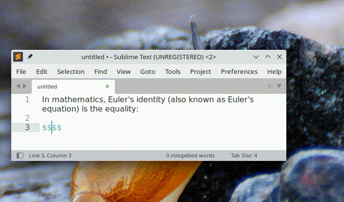
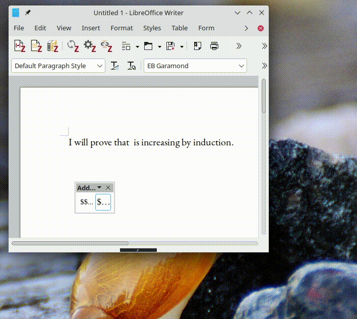

Maths Preview
=======================

A fast and minimal WYSIWYG for LateX mathematical formulas.

<p align="center"></p>


## Desiderata

 - **Real-time Rendering:** see things appear as you type them, not 250ms later. This is possible by using the ReX maths engine (in fact, a fork thereof) instead of calling TeX.
 - **Pluggability:** the previewer should be able to interface with and be launched from typesetting environments, such as text editors or word processors or standalone. See below for Sublime Text and LibreOffice Writer plugins.

## Overview

### Usage

Launch the program (e.g. `cargo r`), write down a formula and see it update in the display in real-time. Close the app ; some output is generated. The option `-f` specifies whether this output is a SVG render of the formula or the simply the LateX code you typed in. The option `-o` specifies where the output file will be written. If left unspecified, the output will be provided on stdout. Using option `-i`, you can specify which formula is displayed on program start.

### Full description of the options

```
Application Options:
  -m, --mathfont             Path to an OpenType maths font to use for render (default: STIX Maths, bundled in the executable)
  -i, --informula            Formula to edit (default: $\left.x^{x^{x^x_x}_{x^x_x}}_{x^{x^x_x}_{x^x_x}}\right\} \mathrm{wat?}$)
  -o, --outfile              Output file ; if left unspecified, output is directed to stdout.
  -d, --metainfo             Whether to output meta-info on stdout (baseline position, font size, formula, etc.). If 'outfile' is not specified, stdout will contain both the output and the meta-info
  -f, --format               Format of 'outfile' ('svg', 'tex') ; defaults to 'tex'
  -s, --fontsize             Size of font in the SVG output (default: 10)
  --display=DISPLAY          X display to use
```

## Building & installing

Run:

```bash
cargo b --release
```

The program depends on some Rust crates and the GTK3 library. Cargo will take care of the Rust dependencies but you will need to install the GTK3 library and its development files yourself. The steps to install the development files needed for GTK3 depend on the OS and distribution. On Debian/Ubuntu: `sudo apt install libgtk-3-dev`.

When build is complete, the executable should be under `target/release/maths_preview`. You can add it to your PATH, e.g. by copying it to in `~/bin`.

## Plugins

### Sublime Text

<p align="center"></p>

Under `clients/sublime-text/`, you will find a Sublime Text package providing the command `MathsPreview: Insert Formula` to use Maths Preview in Sublime Text.

#### Installation


  - copy the package folder in your Package folder (which you can find with the command `Preferences: Browse Packages`)
  - specify the path to the Maths Preview executable in the `math_preview_exe_path` field of the `InsertFormula.sublime-settings` file.

#### Usage

  - Launch `MathsPreview: Insert Formula` at any position in the document (accessible from command palette) ; the executable pops up.
  - Write the formula and exit the window, by using e.g. Esc.
  - The formula you typed is inserted in the document.


### LibreOffice Writer

<p align="center"></p>

#### Installation

Under `clients/libreoffice-writer`, run `make`. This will zip the add-on and automatically add it to LibreOffice Writer.

#### Usage

  - Click on `Inline Formula` or `Block Formula` in the toolbar.
  - Write the formula and exit the window, by using e.g. Esc.
  - The formula you typed is inserted in the document. 

