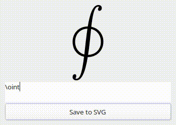

Maths Preview
=======================

A fast and minimal WYSIWYG for LateX mathematical formulas.

<p align="center"></p>


## Desiderata

 - **Real-time Rendering:** see things appear as I type them, not 250ms later.
 - **Pluggability:** the previewer should be able to interface and be launched from typesetting environments, such as text editor (outputs LateX) or LibreOffice Writer (outputs SVG).


## Building & installing

Run:

```bash
cargo b --release
```

The program relies on the GTK3 library. The steps to install the development files needed for GTK3 depend on the OS and distribution. On Debian/Ubuntu: `sudo apt install libgtk-3-dev`.

Copy the executable `target/release/maths_preview` to your PATH, e.g. in `~/bin`.

## Plugins

### Sublime Text

Under `clients/sublime-text/`, you will find a Sublime Text package providing the command `MathsPreview: Insert Formula` to use Maths Preview in Sublime Text.

#### Installation


  - copy the package folder in your Package folder (which you can find with the command `Preferences: Browse Packages`)
  - specify the path to the Maths Preview executable in the `math_preview_exe_path` field of the `InsertFormula.sublime-settings` file.

#### Usage

  - Launch `MathsPreview: Insert Formula` at any position in the document (accessible from command palette) ; the executable pops up.
  - Write the formula and exit the window, by using e.g. Esc.
  - The formula you typed is inserted in the document.


### LibreOffice Writer

(projected)

